# General Info:
#### Name: *M-Unity*
#### Birthday: *29.05.2009*
#### Main Specialty: *Game Development with Godot or Unity*
#### Subspecialty: *Python, Lua and Bash programming*
##### Moving to Codeberg (Even this repository is a mirror from Codeberg :3)
# Current Projects:
#### Personal Game Projects:
|Game title|Current State|Version|Current Engine|Description|
|-|-|-|-|-|
|Tux Flight|Unpublished|0.01|Godot|Casual game where you're playing as Tux who flies across the level|
|2TheFront|Published|0.9|Unity(Move to Godot)|2d 2nd person platformer game that shows its genre from a different angle!|
|Space Hexagons|Published|1.25|Unity|Fun game where you play as a planet and have to avoid hexagons that want to destroy you and earn money to buy planets. There are many gamemodes: Classic mode, ~~One Button Mode~~, Free Move mode, Custom shape and ~~C̷̔̏̎u̵̅͜rs̸͇̞̦̑̆̍e̴d̴͒~~ Mode. Also there are 8 planets for choice.|
|Cubes & Buttons|Published Demo|0.69.9|Unity|Puzzle Game about Cubes & buttons, in which you need to complete test chambers using CARL invention such as CUBE, Clipping field and more!|
|M-Unity's Cubinsanity|Unpublished|1.1002|Godot| |
|Horror "My Abandoned Project"|Unpublished|0.001|Unity| |
|Maxwell Cat Clicker|Unpublished|0.5|Unity| |
|OpenDash3D|Unpublished|0.1|Godot| |
|Yet Another Clicker|Unpublished|0.1|Unity| |
|Time Jumper|Unpublished|0.9|Unity||
|*M-Unity's Adventures*|*Unsupported*|0.2|Unity| |
|*6 Days at GameMechanics*|*Unsupported*|0.9|Unity| |
|*UnityPDF*|*Unsupported*|0.2|Unity| 
#### Team Game Projects:
|Game title|Authors|Current State|Version|Current Engine|Description|
|-|-|-|-|-|-|
|Furries Underground|M-Unity GameDev & Nightmare's Things|Published Demo|1.0| Unity(Move to Godot) | Visual novel that has the style of games of the 90s. The game currently has three full-fledged lines of passage. Everything depends on your choices.|
|Knight Got Lost|M-Unity GameDev & running cactus.|Unpublished|1.0| Unity||
|Tyumen Ride|M-Unity GameDev & running cactus.|Unpublished|1.0|Unity| |
|Arduino Office|M-Unity GameDev & running cactus.|Unpublished|0.67|Unity||
|Arduino Island|M-Unity GameDev & running cactus.|Unpublished|1.0|Unity| |
#### States:
- Published - Finished game that will receive updates
- Published Demo - A demo of unfinished game that is in (almost) active development
- Unpublished - Unfinished game that is in (almost) active development
- Unsupported - Canceled game that will no longer receive updates
